# multi-persona-code-review

A skill that has a coding agent review one diff through a
roster of review personas, check each finding against the
source, and write the findings that hold up back into the
code as `TODO(code-review:<id>)` comments, or into a
`CODE_REVIEW.gpt.md` queue where a comment does not fit. It
ships one program, `run_bounded_review.py`, which runs one
persona
lane under a hard and an idle timeout and writes a result
file when the lane completes, fails, stalls or times out.

Stalled and timed-out lanes still write a status file.

<picture>
  <source
    media="(prefers-reduced-motion: reduce)"
    srcset="assets/poster.svg"
  />
  
</picture>

The demo is reconstructed from
[`evidence/transcripts/bounded-session.txt`](evidence/transcripts/bounded-session.txt),
a captured run of the program in a throwaway directory. The
image leaves out the recorder's `echo` lines.

**Not measured, stated up front.**

- No agent invoked the skill to produce the bounded session
  behind the claim, and no Codex or Claude Code lane ran in
  it. The four lanes in that transcript are shell commands
  and two stand-in scripts, one of which prints a fixed
  finding.
- In the Codex invocation under Evidence, no nested lane
  produced a review: every lane stalled, and the agent
  reviewed the diff itself. In the Claude Code invocation,
  one Codex lane and one Claude Code lane completed; that is
  one run on one fixture.
- How many of an agent's findings are false positives, and
  how well the persona lanes find real defects beyond the
  three planted in that fixture, have not been measured.
- Neither client was started from the install blocks below.
  For the agent invocations, Claude Code loaded the
  repository as a plugin directory and Codex loaded a
  project copy under `.agents/skills/`.
- The program and its tests were run on macOS before this
  release; no run on another system is recorded here. The
  CI workflow runs them on Linux. Windows was not tried,
  and the program uses POSIX process groups.

## What the claim means

"Stalled" is the runner's word for a lane that printed
nothing for `--idle-seconds`; "timed out" is a lane still
running at `--timeout-seconds`. A lane whose exit the
runner sees only after one of those deadlines is recorded
the same way. The "status file" is the
Markdown file at `--out`, plus the JSON file at
`--json-out` when that option is given; both carry a
`status` field. The claim does not cover a command that
cannot be started at all, such as a missing executable or a
missing `--cwd`: the runner then stops with a Python
traceback and writes no result file. Before the command
runs, the runner resolves and checks both result paths: it
creates their parent directories and checks that it can
create a file beside each. Any failure in that step,
including an error from the file system such as a name that
is too long or a symlink loop, exits `2` with a "cannot
write" error and runs nothing; directories it created may
stay. That check is best effort. The claim does not cover a
write that fails after the command ran, for example on a
full disk or where an existing file cannot be replaced.
Both files are written to temporary files and then renamed
into place, Markdown first. A failure or an interruption,
for example Ctrl-C or an agent tool's own time limit, has
one of three outcomes. Before the first rename, neither
result file is created or changed. Between the two renames,
the Markdown file is new and the JSON file is not. After
both, both are new. A runner killed outright can leave a
`.rbr-*.tmp` file beside them, and the lane, which runs in
its own session, can keep running. `SKILL.md` tells the
agent to give that tool call a limit above the lane's
budget.

The runner wakes at least every half second and at each
budget's deadline, and reads at most 1 MiB (1,048,576
bytes) of output per wake, so a lane that writes without
pause is still timed out. Once it has seen the command exit,
or has stopped it, it reads at most 1 MiB more and returns
(after a stop, once it has also waited at most five seconds
for the command to exit), so a background process that keeps
writing does not hold it either; a wake between the exit and the runner seeing it
is a normal capped read, and output written after the last
read is not recorded. A deadline that has
passed by the time the runner sees the command exit decides
the status, so a command that exits just after a deadline is
recorded as `timed_out` or `stalled`, with its own exit code
as `return_code`.
When a lane stalls or times out it sends `SIGTERM` to the lane's
process group and, if the command's own process is still
running five seconds later, `SIGKILL`. If the system
refuses to signal the group (`EPERM`), the runner signals
the command's own process instead. If that process is still
running five seconds after `SIGKILL`, for example because
the runner may not signal it at all, the runner stops
waiting, leaves it running, and records `return_code` as
`null` in the JSON file. A lane can therefore run several
seconds past its budget. `duration_seconds` is measured when
the runner stops waiting for the command, so it includes
that time.

## What is in it

- [`skills/multi-persona-code-review/SKILL.md`](skills/multi-persona-code-review/SKILL.md)
  is the workflow an agent follows: a smoke check of the
  agent CLIs, the bounded execution contract, the diff
  scope, the persona roster, how to run each pass,
  consolidation, verification, write-back and the report.
- [`references/personas.md`](skills/multi-persona-code-review/references/personas.md)
  holds the persona briefs and the rules for the three
  opt-in inputs.
- [`references/write-back.md`](skills/multi-persona-code-review/references/write-back.md)
  holds the marker format, the stable ID, and where each
  comment goes.
- [`references/operational-record.md`](skills/multi-persona-code-review/references/operational-record.md)
  holds how the report keeps each lane's status apart and
  what to say about `address-comments`.
- [`scripts/run_bounded_review.py`](skills/multi-persona-code-review/scripts/run_bounded_review.py)
  runs the command after `--` (the `--` may be left out
  when the command's first word does not start with `-`)
  in `--cwd`, collects its
  stdout and stderr together, and writes the result. It
  exits `0` when the status is `completed` and `2`
  otherwise. Invalid arguments, and a result path its
  pre-run check refuses, also exit `2`, with a message,
  before the command runs and with no result file written.
  Budgets must be positive and finite. `--out` and
  `--json-out` must be separate files. Names that are equal,
  or one inside the other, after Unicode NFC normalisation
  and case folding are refused, as are two existing names
  for one file and two names in one existing directory that
  match after that normalisation. Other ways a file system
  can make two names one file are not detected. The lane's stdin is `/dev/null`, so a command
  that waits for input reads end-of-file at once.

The persona passes themselves run on Codex
(`env -u npm_config_package npx -y @openai/codex`) or
Claude Code
(`env -u npm_config_package npx -y @anthropic-ai/claude-code`),
as `SKILL.md` describes. The `env -u` prefix removes
`npm_config_package`, which an `npx --package ...` parent
process, such as one that launched the agent client, leaks
to everything it starts; a nested `npx` that inherits it
tries to run the package name as a command and fails. The
runner does not choose or check the command; it runs
whatever follows `--` with the runner's own environment,
unchanged.

### Opt-in personas

Three personas run only when the caller supplies a document
path for them, under these names:

- `cuj_doc` activates the CUJ reviewer;
- `plan_doc` activates the plan reviewer;
- `compliance_doc` activates the legal/SOC2 compliance
  reviewer, which also runs on an explicit compliance flag.

For example: "review the uncommitted changes with
`plan_doc=/abs/path/plan.md`". No program parses these
names. The agent reads them from the request and passes each
path into its persona's prompt.

### Where the files go

Every example in `SKILL.md` that writes a file writes it
under `<out-dir>`, a directory the operator chooses; there
is no default.
`SKILL.md` asks for one outside the reviewed repository, so
the result files are not part of the diff under review.

### The marker keeps the old name

This skill was first written under the name `code-review`.
It is published as `multi-persona-code-review` because
Claude Code bundles an unrelated skill called `code-review`.
The marker `TODO(code-review:<id>)` and the spillover file
`CODE_REVIEW.gpt.md` are unchanged on purpose: they are the
strings the `address-comments` skill looks for, so renaming
them would break that hand-off.

## Not included

This skill names two other skills and two agent CLIs. None
of them ships here.

- The l8() tech-lead pass uses the `l8` skill, which is
  published separately as `trycopilotai/l8`. Without `l8`
  installed, `SKILL.md` tells the agent to record the l8()
  lane as `not_run`, to leave out the L9/L10 addendum, and
  to say so in the report.
- `address-comments` is the skill that acts on the
  `TODO(code-review:<id>)` markers this one writes, and it
  is published separately as `trycopilotai/address-comments`.
  Without it, nothing acts on the markers; they stay in the
  source until someone resolves them.
- Codex and Claude Code are not installed by this
  repository. `npx` fetches them from npm when they are not
  already in its cache.

`trycopilotai/l8` and `trycopilotai/address-comments` are
being released at the same time as this repository and may
not be public when you read this.

## Use it

Read [`skills/multi-persona-code-review/SKILL.md`](skills/multi-persona-code-review/SKILL.md)
before you install it. The file is an instruction set that
steers an agent, and its runner-wrapped Codex commands pass
`--yolo`, so
both installs below are pinned to a tag rather than to
`main`.

### Claude Code

Save this as `install.sh` and run it with `sh install.sh`.
It sets `set -eu` and an `EXIT` trap, so pasting it straight
into an interactive shell will end that shell if the clone
fails.

```sh
set -eu
release=v0.1.5
install_target="$HOME/.claude/skills/multi-persona-code-review"
install_parent="$(dirname "$install_target")"
mkdir -p "$install_parent"
install_tmp="$(mktemp -d "$install_parent/.multi-persona-code-review.XXXXXX")"
install_stage="$install_tmp/package"
rollback_install() {
  if [ ! -e "$install_target" ]; then
    if [ -e "$install_tmp/previous" ]; then
      mv "$install_tmp/previous" "$install_target"
    fi
  fi
  rm -rf "$install_tmp"
}
trap rollback_install EXIT
git clone --quiet --depth 1 --branch "$release" \
  https://github.com/trycopilotai/multi-persona-code-review \
  "$install_tmp/clone"
mkdir -p "$install_stage"
cp -R "$install_tmp/clone/skill/." "$install_stage/"
if [ -e "$install_target" ]; then
  mv "$install_target" "$install_tmp/previous"
fi
mv "$install_stage" "$install_target"
trap - EXIT
rm -rf "$install_tmp"
```

Invoke it as `/multi-persona-code-review`.

### Codex

Save this one the same way. The only line that differs from
the block above is `install_target`.

```sh
set -eu
release=v0.1.5
install_target="$HOME/.agents/skills/multi-persona-code-review"
install_parent="$(dirname "$install_target")"
mkdir -p "$install_parent"
install_tmp="$(mktemp -d "$install_parent/.multi-persona-code-review.XXXXXX")"
install_stage="$install_tmp/package"
rollback_install() {
  if [ ! -e "$install_target" ]; then
    if [ -e "$install_tmp/previous" ]; then
      mv "$install_tmp/previous" "$install_target"
    fi
  fi
  rm -rf "$install_tmp"
}
trap rollback_install EXIT
git clone --quiet --depth 1 --branch "$release" \
  https://github.com/trycopilotai/multi-persona-code-review \
  "$install_tmp/clone"
mkdir -p "$install_stage"
cp -R "$install_tmp/clone/skill/." "$install_stage/"
if [ -e "$install_target" ]; then
  mv "$install_target" "$install_tmp/previous"
fi
mv "$install_stage" "$install_target"
trap - EXIT
rm -rf "$install_tmp"
```

Invoke it as `$multi-persona-code-review`.

Each block works in a temporary
`.multi-persona-code-review.*` directory beside the target
and removes it when the script exits, on success or on an
error; a script killed outright leaves it behind. An
existing install at the target is replaced.

While it clones, `git` 2.50 prints a warning that the tag
"is not a commit" and its detached `HEAD` advice, even with
`--quiet`. Both are expected for a clone pinned to an
annotated tag.

Both blocks copy through `skill/`, a symlink to
`skills/multi-persona-code-review/`, so the installed
directory holds `SKILL.md`, `agents/`, `references/` and
`scripts/` as real files. The repository also carries
`.claude-plugin/plugin.json` and `.codex-plugin/plugin.json`
for a marketplace. No marketplace lists this skill, so no
marketplace install is described here. The Codex manifest
has no `composerIcon` or `logo`, which a Codex directory
submission asks for, so it is not ready for submission as
shipped.

## Evidence

`evidence/transcripts/bounded-session.txt` is the captured
run behind the claim at the top of this file.
`scripts/record_session.py` wrote each `$` line and each
exit status; the rest is the commands' output, with one
edit: the throwaway directory's path was replaced with
`/work`. The transcript itself carries no notice of that.
`evidence/demo-manifest.json` is where the edit is declared,
as `replace-capture-root`, beside the SHA-256 of the program
and of `SKILL.md`, the commands, the interpreter, the date,
and the SHA-256 of the transcript.

The session runs the program four times against one small
git repository with an uncommitted change. The first lane is
a stand-in script that prints one fixed finding in the
persona output shape and exits 0. The second exits 3. The
third runs `sleep 30` with a one-second idle budget. The
fourth prints a line every quarter second with a two-second
hard budget. The runner exits 2 for the last three, and a
`grep` of the four JSON files shows `completed`, `failed`,
`stalled` and `timed_out`.

`make check` runs the program's own tests and a packaging
contract that ties this file, both plugin manifests, the
transcript and the demo images to each other.

### Agent invocations

Each client has one published run of the skill on a
synthetic workspace: a git repository holding a small Python
module with an uncommitted change that carries three planted
defects (an off-by-one slice, a missing check that a regular
expression matched, and a function named for debits that
sums credits), and tests that pass. Each prompt asked for at
most two persona lanes through the bundled runner with small
budgets. This is one published run per client on one
fixture, not a benchmark.

- [`evidence/transcripts/2026-10-08-claude-code-invocation.txt`](evidence/transcripts/2026-10-08-claude-code-invocation.txt):
  Claude Code 2.1.220, with the v0.1.3 skill, loaded the
  skill and ran two smoke checks, a Codex version probe and
  two persona lanes through the runner, each command
  starting with `env -u npm_config_package`. All five were
  recorded as `completed`. The lanes were `codex-baseline`
  (`codex exec review --uncommitted`) and
  `claude-test-coverage` (`claude -p` with the diff in the
  prompt), and each returned findings for the three planted
  defects. The agent checked them against the source, wrote
  three `TODO(code-review:<id>)` comments, recorded the
  l8() lane as `not_run` and left out the L9/L10 addendum.
- [`evidence/transcripts/2026-10-08-codex-invocation.txt`](evidence/transcripts/2026-10-08-codex-invocation.txt):
  Codex 0.146.0, with the v0.1.0 skill, in its
  `workspace-write` sandbox, ran two lanes and one smaller
  retry through the runner. All three were recorded as
  `stalled` with no output. It then reviewed the diff
  itself as a recorded fallback, wrote three markers for the
  same three defects, and recorded the l8() lane as
  `not_run`.

Neither run committed anything, and in both the write-back
added only comment lines. The Claude Code run's final
message gives the findings' line numbers as they were before
write-back; the manifest notes this.

`scripts/render_invocation.py` rendered each transcript from
the client's raw log. Its edits are these, and no others:

- it replaces only the path prefixes and host name the
  manifest names, in this order: `replace-isolation-root`,
  `replace-scratch-root`, `replace-plugin-root`,
  `replace-capture-root`, `replace-home`,
  `replace-hostname`;
- it prints each tool argument and each message the agent
  wrote between calls on one line, JSON-escaped, and clips
  it at 400 characters with a note of how many were cut;
- it trims trailing newlines from the prompt and from the
  final message;
- it prints each tool result only as a status, a Codex item
  of an unknown type only by its type name, and leaves out
  the rest of the log: in a Claude Code log, thinking
  blocks, empty text blocks, user content other than tool
  results, and every event other than `system` `init`,
  `assistant`, `user` and `result`; in a Codex log, every
  event other than `thread.started`, `item.completed` and
  `turn.completed`.

The manifest also lists two Claude Code runs with
`"published": false`, each with the SHA-256 of its raw log:
the v0.1.0 run published in v0.1.1 and v0.1.2, whose four
lanes were all recorded as `failed` because the nested `npx`
printed `sh: @openai/codex: No such file or directory` (and
the same for Claude Code); and, before it, a run whose
diagnosis of the same failure ran commands outside the
workspace and was replaced by a run in a fresh temporary
directory.

### Known limits

- The cause of the stalled Codex lanes was not established.
  The Codex session log records its sandbox as
  `workspace-write` with `network_access: false`. In a
  separate check, not part of the recorded run, Codex
  0.146.0's `codex sandbox -P :workspace` ran
  `npx -y @openai/codex --version`, with and without the
  `env -u npm_config_package` prefix. Both failed with an
  npm network error after about 70 seconds; with the prefix,
  the first output, npm's `ENOTFOUND`, came after about 71
  seconds of silence.
  That is consistent with a lane that stalls without
  network, but the Codex run has not been repeated with this
  release.
- The documented lane commands run `npx -y` without a
  version, so a lane gets whatever release npm serves that
  day. In the Claude Code run they were Claude Code 2.1.295
  and Codex 0.162.0, not the 2.1.220 that ran the agent.
- The Claude Code run loaded the v0.1.3 files from a copy of
  the working tree before the release commit, not from the
  tag.
- A nested `npx` uses npm's cache, by default in the home
  directory, so a lane reads and writes outside the workspace
  even when the agent's own tool calls stay inside it.

## Contributing

See [`CONTRIBUTING.md`](CONTRIBUTING.md).

## Security

See [`SECURITY.md`](SECURITY.md).

## License

MIT. See [`LICENSE`](LICENSE).

## Not affiliated with GitHub or GitHub Copilot

The `trycopilotai` organisation name is not a claim of any
relationship with GitHub Copilot. This project is not
affiliated with, endorsed by, or sponsored by GitHub, Inc.
GitHub and GitHub Copilot are trademarks of GitHub, Inc.
